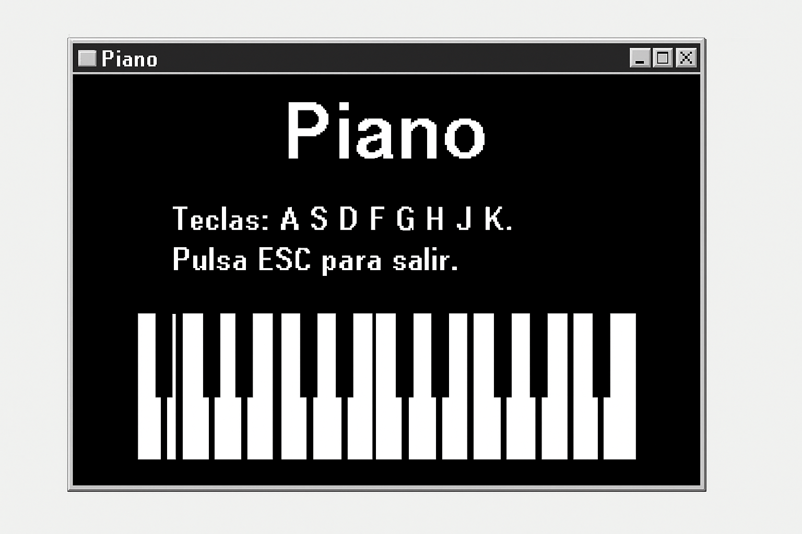

<h1>Piano en ensamblador</h1>

Este proyecto es un piano simple programado en ensamblador x86, pensado para ejecutarse en DOSBox.
Cada tecla del teclado (A S D F G H J K L) reproduce una nota diferente mediante el altavoz del PC.
El programa se ensamblará como un archivo .COM ejecutable en entorno DOS.

<h2>⚠️ Estado actual</h2>

El proyecto aún no está completamente funcional, ya que no se ha generado el ejecutable final (.com).
Se encuentra en desarrollo y en fase de pruebas.
